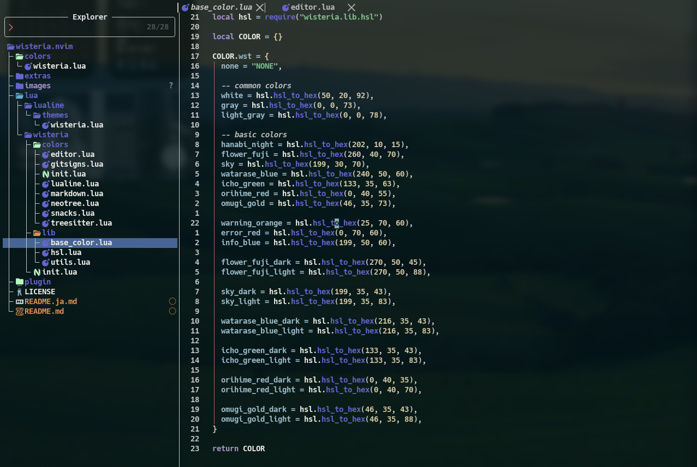

# Wisteria - Neovim カラースキーム

他言語
[🇺🇸](./README.md)



## 🎨 デザイン

Wisteriaは、透明な端末環境での視認性を向上させるため、明るさと彩度を強化したダークカラースキームです。柔らかな紫、青、緑を基調とした配色で、快適なコーディング体験を提供します。

このカラースキーマは[LazyVim](https://www.lazyvim.org)向けに設計されており、人気のNeovimプラグインをサポートしています。

## ✨ 機能

- 最新の[Neovim](https://github.com/neovim/neovim/releases)機能をサポート
- 透過背景に最適化
- 人気のNeovimプラグインをサポート:
  - lualine
  - treesitter
  - neotree
  - snacks
  - markdown
  - gitsigns
- ターミナルとプロンプト用の追加テーマ:
  - WezTerm
  - Starship
  - tmux

## 🚀 インストール

### LazyVim

```lua
{
  "LazyVim/LazyVim",
  opts = {
    colorscheme = "wisteria",
  },
},
{
  "masisz/wisteria.nvim",
  name = "wisteria",
  opts = {
    transparent = true,
		---@type fun(colors:WisteriaColors):HighlightSpec
		overrides = function(colors) return {} end,
  },
},
{
  "nvim-lualine/lualine.nvim",
  opts = {
    theme = "wisteria",
  },
}
```

## 🎨 追加テーマ

### WezTerm

```lua
-- ~/.config/wezterm/wezterm.lua
local wisteria = require("path/to/wisteria.nvim/extras/wezterm/wisteria")

return {
  colors = wisteria.colors,
  -- ... その他の設定
}
```

### Starship

```bash
# Starship設定ディレクトリにコピー
cp extras/starship/starship.toml ~/.config/starship.toml
```

または既存の設定に追加:

```toml
palette = "wisteria"

# extras/starship/starship.tomlからパレットをインポート
```

### tmux

```bash
# ~/.config/tmux/tmux.confに追加
source-file /path/to/wisteria.nvim/extras/tmux/wisteria.conf

# tmux設定を再読み込み
tmux source-file ~/.config/tmux/tmux.conf
```
